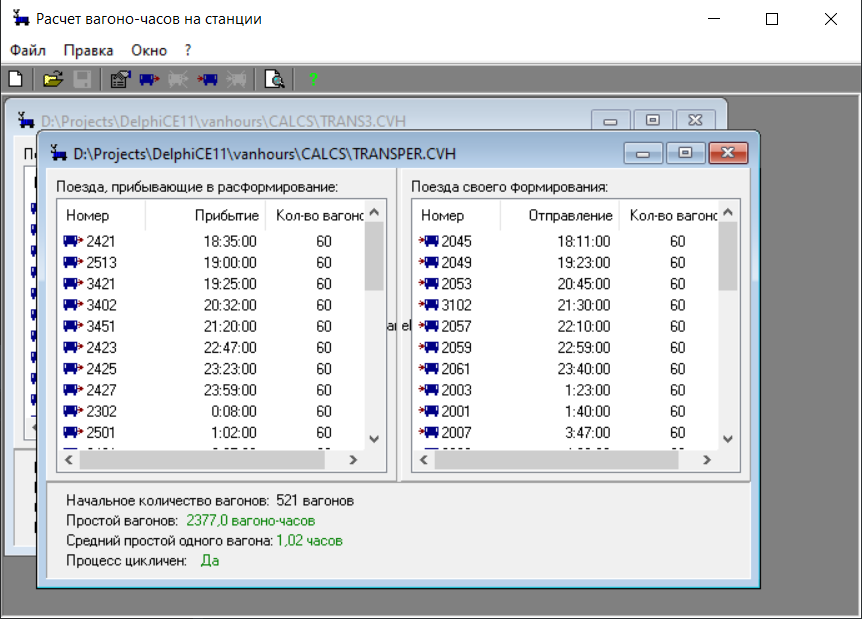
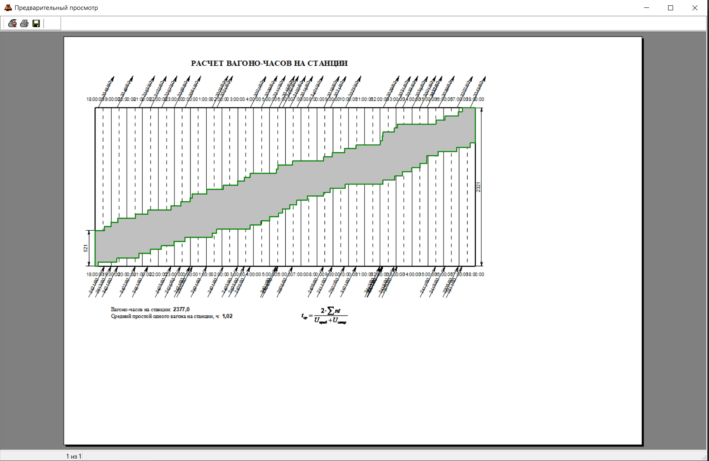

# vanhours
Расчет вагоно-часов простоя вагонов на станции

## Работа с приложением

Создайте новый проект.
Добавьте прибывающие поезда с указанием времени и количества вагонов.
Добавьте отправляющие поезда с указанием времени и количества вагонов.

Приложение покажет является ли процесс цикличным (кол-во приходящих и уходящих вагонов совпадают).

Нажмите Просмотр диаграммы для показа графика. Там можно настроить принтер и распечатать его.

### Code

This is Delphi CE 11.3 application

### Releases

For direct downloads, check out [Releases](../../releases).

## Contributing

For simple bug reports and fixes, and feature requests, please simply use projects
[Issue Tracker](../../issues)
